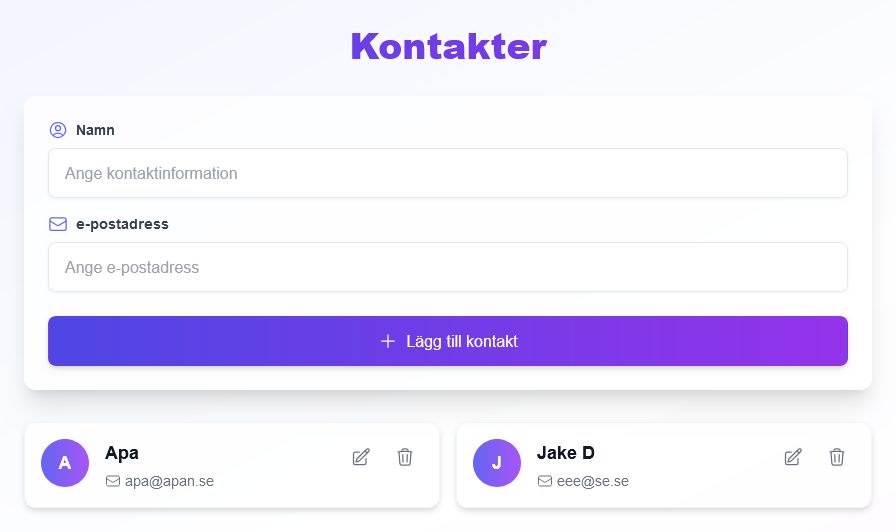
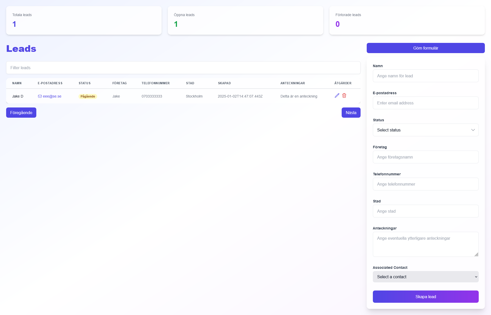

# Pnotis CRM

Pnotis CRM is a Customer Relationship Management (CRM) system currently in very early development (no accounts or signups as of yet). This project aims to provide a robust and efficient solution for managing customer interactions and data.

## Technologies Used

- **Next.js**: A React framework for building server-side rendered and statically generated web applications.
- **Tailwind CSS**: A utility-first CSS framework for rapidly building custom user interfaces.
- **Neon Tech Database**: A serverless database solution for managing and storing application data.

## Project Status

This CRM is a work in progress. Features and functionalities are being actively developed and improved.

## Getting Started

To get started with the project, clone the repository and install the dependencies:

```bash
git clone https://github.com/yourusername/pnotis-crm.git
cd pnotis-crm
npm install
```

Make sure to create an account on https://neon.tech/ and put your key inside .env as DATABASE_URL=''

## Running the Application

To run the application in development mode, use the following command:

```bash
npm run dev
```




This will start the Next.js development server. Open your browser and navigate to `http://localhost:3000` to see the application in action.

## Contributing

Contributions are welcome! If you have any suggestions or improvements, please create a pull request or open an issue on the GitHub repository.
